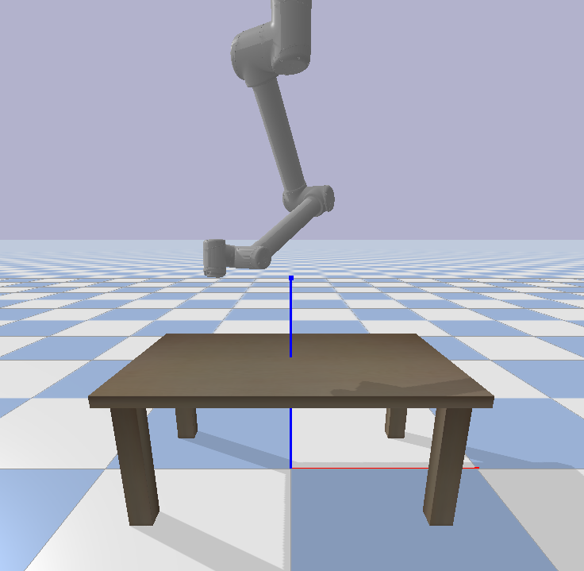
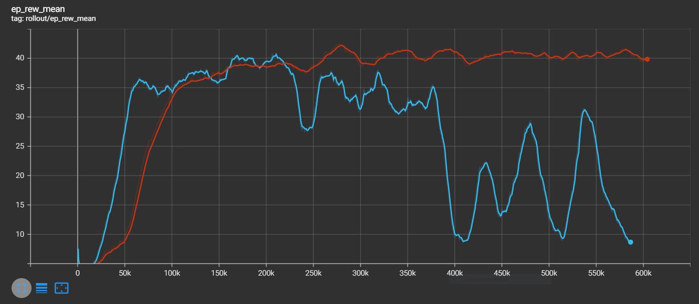

# PyBullet UR10 RL project 

В данном проекте создается Gym Environment для управления роботом-манипулятором UR10.
RL агент обучается приводить конечный эффектор в заданную пользователем точку.

### Полезные ссылки
- симулятор PyBullet - https://pybullet.org
- модель робота UR10 (xacro файлы) - https://github.com/UniversalRobots/Universal_Robots_ROS2_Description
- фреймворк Stable Baselines3 - https://github.com/DLR-RM/stable-baselines3

## Информцация о файлах проекта и способах запуска
### Среда выполнения
* Python 3.8.7
* Зависимоси из requirements.txt

### Описание проекта
- `images/` - картинки для страницы с описанием
- `logs/` - логи обучения
- `models/` - сохраненные веса моделей
- `ur_description/` - файлы с описанием моделей UR роботов
- `xacro/` - файлы для генерации urdf-файла модели робота UR10
- `reach.py` - скрипт запуск симуляции и приведения конечнго эффектора в указанную точку
- `robot_env.py` - содержит описание gym environment для обучения RL моделей
- `robot_ur10.urdf` - конечный urdf-файл, который используется в симуляторе
- `run_model.py` - скрипт запуска моделей для визуальной проверки результатов
- `test_sim.py` - скрипт запуска симулятора в тестовом режиме (для удобства просмотра сцены)
- `train_model.py` - скрипт обучения моделей

### Основные команды
Просмотр логов обучения в Tensorboard:
```
tensorboard --logdir ./logs/ 
```
Просмотр сцены:
```
python test_sim.py 
```
Запуск обучения модели:
```
python train_model.py 
```
Запуск тестовых прогонов с обученной моделью (требуется указать путь до желаемых весов модели `model_path = "models/1690771190/260000.zip"`):
```
python run_model.py 
```
Запуск функции REACH - требуется передать координаты конечной точки (пределы, определены 
в `RobotEnv()` -> `self.position_bounds = [(-0.5, 0.5), (-0.5, 0.5), (0.8, 1)])`:
```
python .\reach.py --c '-03., 0.3, 0.8' 
```

## Environment
### Описание сцены в симуляторе
Модель робота-манипулятора UR10 без захватного устройства, установленная над моделью стола.



### Observation
```
obs[:3] = effector_position
obs[3:6] = effector_orientation
obs[6:9] = effector_velocity
obs[9:12] = target_position - effector_position
 ```
### Action
```
obs[:3] = желаемые относительные координаты эффектора (в долях доступной площади)  
 ```
### Reward
```
distance = np.linalg.norm(effector_position - target_position)
reward = 1 / distance - reward_prev 
reward_prev = 1 / distance 
```

### Результаты обучения
<span style="color:lightblue">*Голубая линия*</span> - A2C   
<span style="color:red">*Красная линия*</span> - PPO



### Вывод
- В среднем алгоритм PPO показал себя лучше, чем A2C.
- Оба алгоритма показывают неудовлетворительный результат при низком расположении 
манипулятора над столом, требуется дополнительная работа над функцией награды.  
